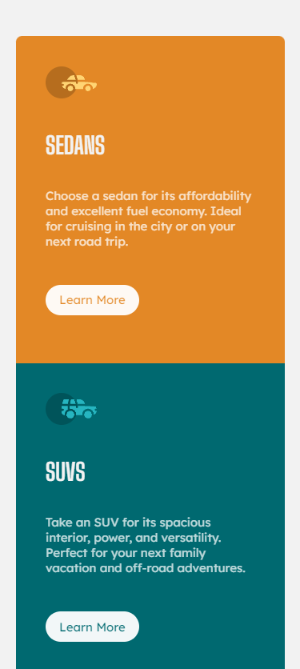
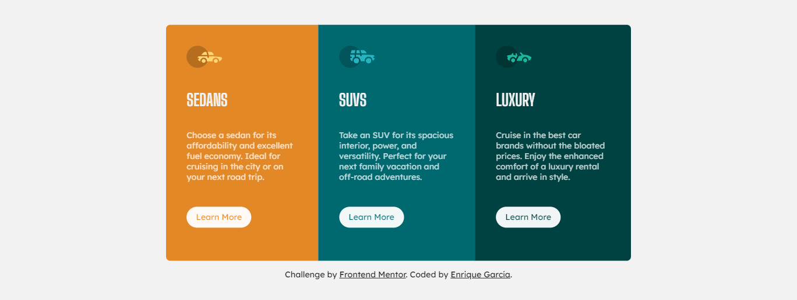

# Frontend Mentor - 3-column preview card component solution

This is a solution to the [3-column preview card component challenge on Frontend Mentor](https://www.frontendmentor.io/challenges/3column-preview-card-component-pH92eAR2-). Frontend Mentor challenges help you improve your coding skills by building realistic projects. 

## Table of contents

- [Overview](#overview)
  - [The challenge](#the-challenge)
  - [Screenshot](#screenshot)
  - [Links](#links)
- [My process](#my-process)
  - [Built with](#built-with)
  - [What I learned](#what-i-learned)
  - [Useful resources](#useful-resources)
- [Author](#author)


## Overview

### The challenge

Users should be able to:

- View the optimal layout depending on their device's screen size
- See hover states for interactive elements

### Screenshot


 

### Links

- Solution URL: [Here](https://github.com/frontend-mentor-riskezwn/3-column-preview-card-component-main)
- Live Site URL: [Here](https://frontend-mentor-riskezwn.github.io/3-column-preview-card-component-main/)

## My process

I have designed first adapting the web to mobile devices, so that later it would be easier to adapt it to the desktop.

### Built with

- Semantic HTML5 markup
- CSS custom properties
- Flexbox
- CSS Grid
- Mobile-first workflow

### What I learned


```css
.box:first-child {
    border-radius: 0.5em 0.5em 0 0;
}
```

### Useful resources

- [:first-child and :last-child](https://css-tricks.com/almanac/selectors/f/first-child/) - This helped me round only the first and last element


## Author

- Website - [Enrique Garcia](https://www.enriquegarcia.dev)
- Frontend Mentor - [@riskezwn](https://www.frontendmentor.io/profile/riskezwn)

